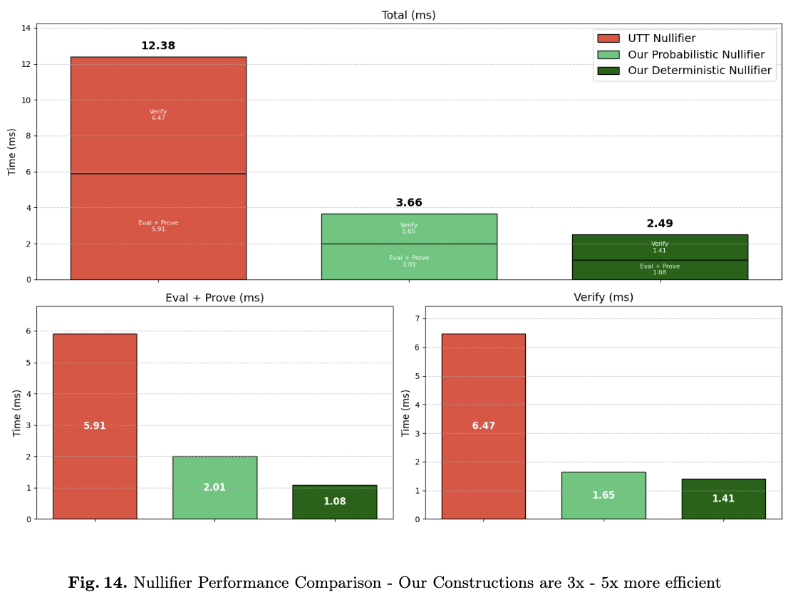

# nullifiers

This project is for a block of thesis work (Chapter 4) and soon to be paper writeup.
There are a few improvements to the existing primitives.

1. First, I made a faster version of the dodis yampolskiy vrf by keeping it in 1 group instead of using pairings. The proof is now a sigma protocol zkp rather than the pairing. To do this I needed to make a new Sigma protocol. The details for this are in [dy_pf.rs](src/dy_pf.rs). Sorry for the file naming, I will change it for publication.
2. Created 2 different nullifiers, a deterministic version [deterministic nullifier](src/dy_pf_priv.rs) and probablistic nullifier, also known as committed nullifier or rerandomizable nullifier, I'm still locking down the best name. It's here [rerandomizable nullifier](src/dy_pf_priv_commited_output.rs) also based off new sigma protocols I haven't seen before.
3. compared these to the previous state of the art

## Results

### Dodis Yampolskiy Vs Me

I compared my construction to original DY on different curves (because mine no-longer needs a pairing curve) though realistically it would probably be implemented with a pairing curve.
See, much faster!


### UTT Nullifier vs Me

UTT has a nullifier scheme based off the DY but it's privacy preserving (like a nullifier should be). Here are my results against that one (much faster!)



## What are Nullifiers?

A nullifier is a privacy-preserving, publicly-provable, unique output generated from a user's private information, enabling actions like spending coins, voting anonymously, or issuing credentials while preventing double-spending and maintaining anonymity through zero-knowledge proofs. Nullifiers are currently defined within specific contexts in privacy-preserving protocols like Zcash, Tornado Cash, and Crypto-Wallets like MetaMask and Ledger, but there is no standard definition with its own security properties

## Installation

```sh
# Clone the repository
git clone https://github.com/sampolgar/nullifiers.git
cd nullifiers

# Bench (assumed you have rust installed)
cargo bench
```

## Citation

If you use MIMC-ABC in your research, please cite it as:

```
@software{nullifiers,
  author = {Polgar, Sam},
  title = {Nullifiers from the q-DDHI},
  url = {https://github.com/sampolgar/nullifiers},
  year = {2025}
}
```

Originally from my project `https://github.com/sampolgar/anonymous-credentials/`
